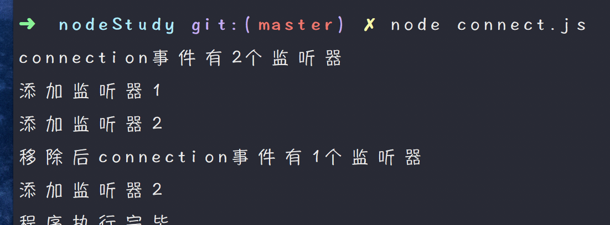
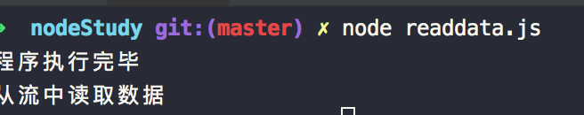
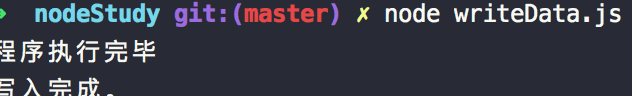

#####node.js的回调函数
#####例如我们可以一边读取文件，一遍进行其他操作，在文件读取完毕之后，我们将文件内容作为回调参数返回，这样代码就不会阻塞。

#####创建input.txt
#####创建main.js（阻塞状态）

</img>

#####创建mainCorrect.js(非阻塞状态)
</img>

#####node事件循环
#####node是单线程单进程的，引入v8引擎的异步执行回调接口，所以可以处理大量的并发。
</img>
#####node使用事件驱动程序，当web server接收到事件请求，就把它关闭然后进行处理，然后去服务下一个web请求。当这个请求完成，它被放回处理队列，当到达队列开头，这个结果被返回给用户。
#####在这个过程中，web server一直接受请求而不等待任何读写操作。
#####创建mainWhile.js(1.引入模块 2.绑定事件处理机制 3.触发指定的事件)
</img>

#####EventEmitter类，events模块只提供了一个对象(events.EventEmitter)，EventEmitter 的核心就是事件触发与事件监听器功能的封装。
#####EventEmitter属性介绍: {
       方法: {
               1.addListener(event, listener)    // 为指定事件添加一个监听器到监听器数组的尾部。
               2.on(event, listener) // 为指定事件注册一个监听器，接受一个字符串 event 和一个回调函数。
               3.once(event, listener) // 为指定事件注册一个单次监听器，即 监听器最多只会触发一次，触发后立刻解除该监听器。
               4.removeListener(event, listener) // 移除指定事件的某个监听器，监听器必须是该事件已经注册过的监听器。它接受两个参数，第一个是事件名称，第二个是回调函数名称。
               5.removeAllListeners([event]) // 移除所有事件的所有监听器， 如果指定事件，则移除指定事件的所有监听器。
               6.setMaxListeners(n) // 默认情况下， EventEmitters 如果你添加的监听器超过 10 个就会输出警告信息。 setMaxListeners 函数用于提高监听器的默认限制的数量。
               7.listeners(event) // 返回指定事件的监听器数组。
               8.emit(event, [arg1], [arg2], [...]) // 按监听器的顺序执行执行每个监听器，如果事件有注册监听返回 true，否则返回 false。
       }
       类方法: {
              1.listenerCount(emitter, event) // 返回指定事件的监听器数量。
              使用方法: events.emitter.listenerCount(eventName) //推荐
       }
       事件： {
              1.newListener(event, listener) // 该事件在添加新监听器时被触发。
              2.removeListener(emitter, event) // 从指定监听器数组中删除一个监听器。需要注意的是，此操作将会改变处于被删监听器之后的那些监听器的索引。
       }
}
#####创建connection.js(方法测试)
</img>

#####当必须使用到二进制数据的时候，node定义了Buffer类，该类用来创建一个专门存放二进制数据的缓存区

#####Stream是一个抽象接口，发送http请求的request对象即是。有四种流类型
#####1.Readable // 可读操作
#####2.Writable // 可写操作。
#####3.Duplex // 可读可写操作.
#####4.Transform // 操作被写入数据，然后读出结果。

#####所有的 Stream 对象都是 EventEmitter 的实例。常用的事件有：
#####1.data - 当有数据可读时触发。
#####2.end - 没有更多的数据可读时触发。
#####3.error - 在接收和写入过程中发生错误时触发。
#####4.finish - 所有数据已被写入到底层系统时触发。

#####从流中读取数据
#####创建readData.txt和创建readData.js
</img>

#####写入流到outputData.txt
#####创建writeData.js
#####执行后会在目录生成outputData.txt，内容则是在writeData.js中定义要写入的内容
</img>

#####管道流，读取source的文件流入到dest中
#####创建pipe.js,这边以readData.txt作为source，以pipeData.txt作为des
#####执行后会把readData.txt的内容写到pipeData.txt中

#####链式流，通过连接输出流到另外一个流。一般用于管道操作
#####创建compress.js(压缩文件)
#####执行完compress.js之后会在目录中生成compress.txt和compress.txt.gz
#####创建decompress.js(解压文件)
#####目录中的decompress.txt.gz解压生成一个新的名为decompress.txt的文件

#####node中的模块系统,module.export

#####node路由（与apache不同的是没有真实的物理映射关系，这叫做顶层路由设计，能够制作顶层的路由设计的语言比较流行的只有node.js和python）
#####创建router.js和router.json

