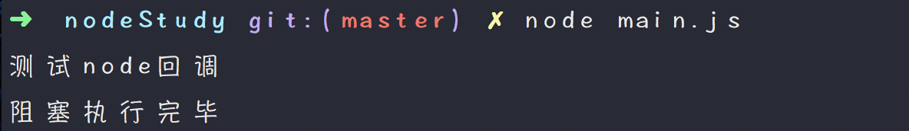
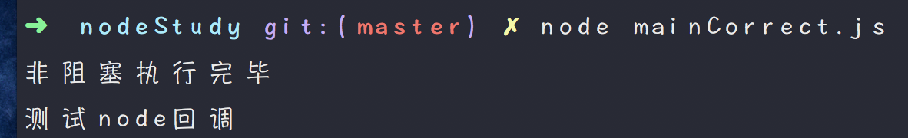
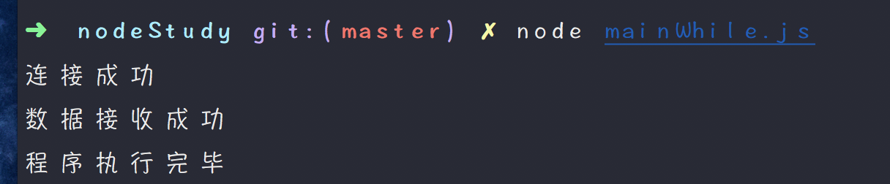

#####node.js的回调函数
#####例如我们可以一边读取文件，一遍进行其他操作，在文件读取完毕之后，我们将文件内容作为回调参数返回，这样代码就不会阻塞。

#####创建input.txt
#####创建main.js（阻塞状态）

</img>

#####创建mainCorrect.js(非阻塞状态)
</img>

#####node事件循环
#####node是单线程单进程的，引入v8引擎的异步执行回调接口，所以可以处理大量的并发。
</img>
#####node使用事件驱动程序，当web server接收到事件请求，就把它关闭然后进行处理，然后去服务下一个web请求。当这个请求完成，它被放回处理队列，当到达队列开头，这个结果被返回给用户。
#####在这个过程中，web server一直接受请求而不等待任何读写操作。
#####创建mainWhile.js
</img>

